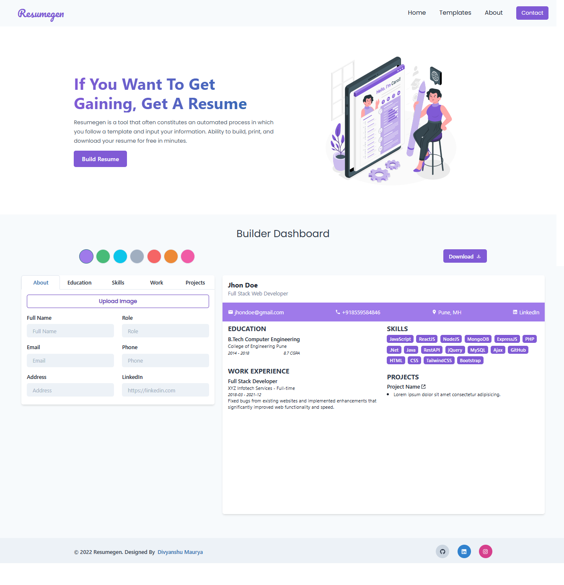

# ResumeGen

🚀 A ReactJS-based Resume Generator that helps you build a personalized and professional resume within minutes by filling out simple step-by-step sections.

## 🖥️ Tech Stack

&nbsp;
&nbsp;
&nbsp;
&nbsp;

Extras: React-To-Print, Custom Image Upload, Themed Layouts

## Sneak  Peek of Home Page 🙈 :

<h2>📬 Contact</h2>

If you want to contact me, you can reach me through below handles.

© 2025 Divyanshu Maurya

Keep Exploring

